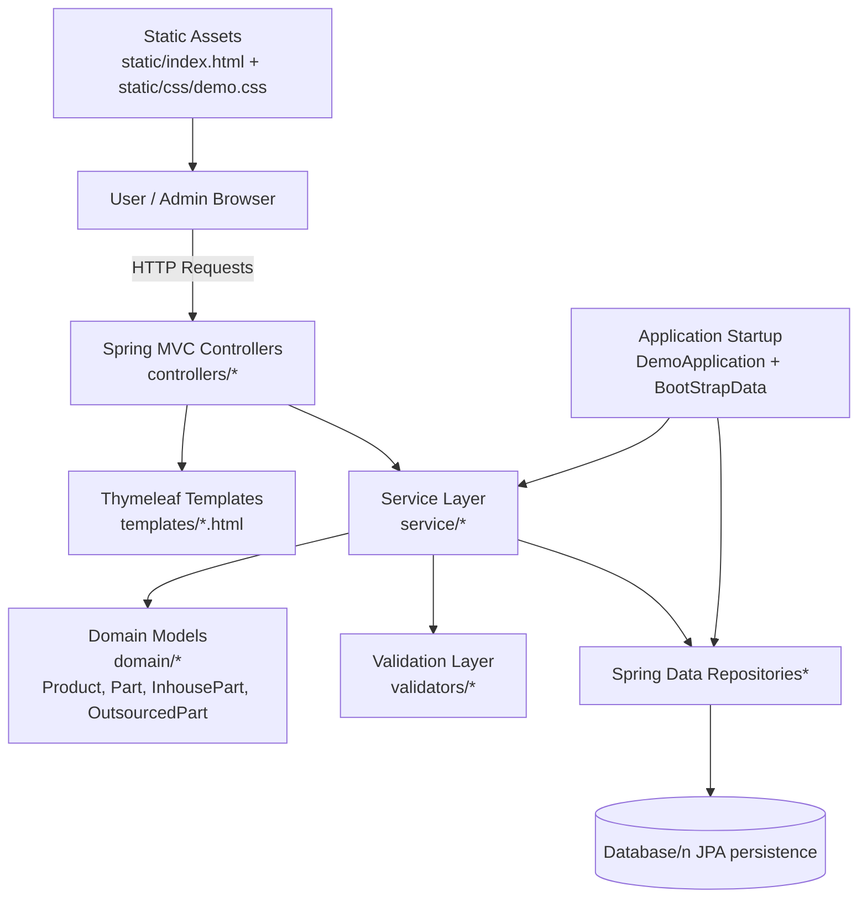
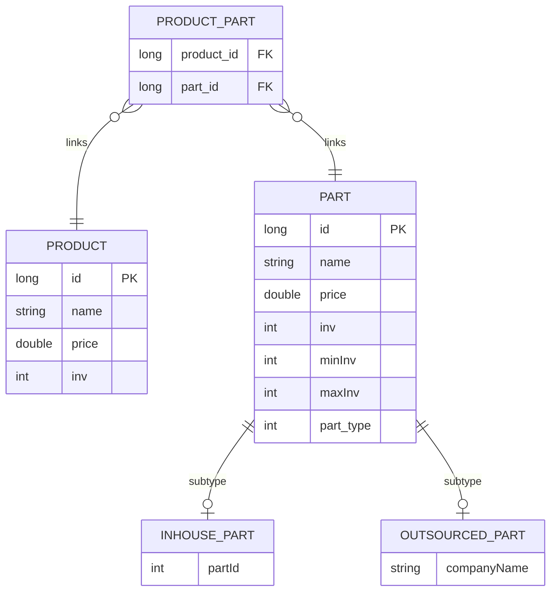

# ☕ Teahouse

## Overview

Teahouse is a full-stack web application that manages both **customer-facing order placement** and **internal inventory management** for a tea shop.

## Features

### Customer Interface
- Browse and place tea orders

### Admin/Inventory Interface
- Stock level monitoring

## Technical Stack

**Backend:**
- SpringBoot

**Frontend:**
- HTML/CSS/JavaScript

## Setup Instructions

### Requirements

- Java 17 or higher
- MySQL
- Maven (or use the included `mvnw` wrapper)

### 1. Run the Application
In one console run the Spring Boot backend:
```
./mvnw spring-boot:run
```
Maven will download dependencies and start the application on http://localhost:8080.


## Project Architecture Diagram



## Project ER Diagram



## Example Screenshots
### Main Page

### Add Product Form

### Modify Product Form
